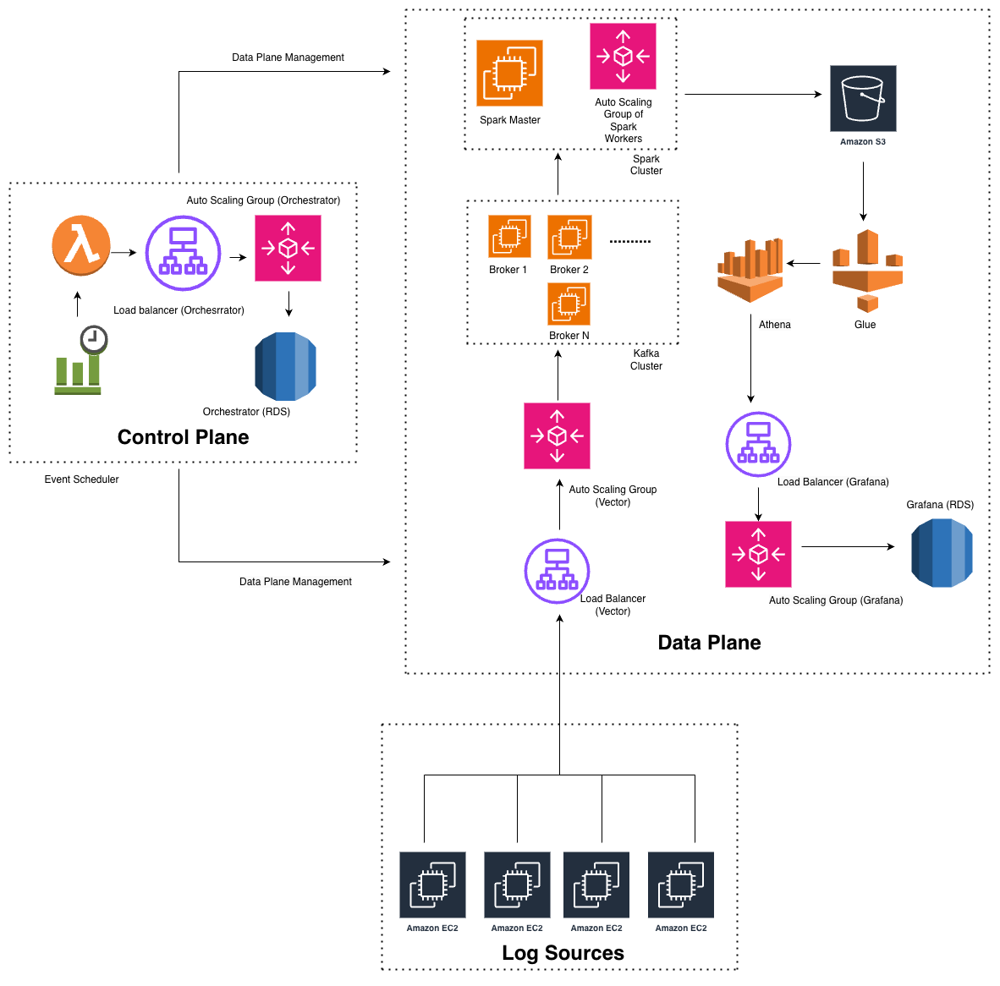

# Production-Ready Self-Hosted Setup Guide

This architecture provides a horizontally scalable and highly available production deployment of Logwise. For detailed component setup, refer to individual guides:

- [Vector Setup](./vector-setup.md) | [Kafka Setup](./kafka-setup.md) | [Spark Setup](./spark-setup.md)
- [Orchestrator Setup](./orchestrator-service-setup.md) | [Grafana Setup](./grafana-setup.md) | [S3 & Athena Setup](./s3-athena-setup.md)

# Architecture Overview

Logwise is split into two planes:

- **Control Plane** – Orchestrator services that monitor workloads and change capacity (Spark workers, Kafka partitions, etc.).

- **Data Plane** – Ingestion, processing, storage, and querying of logs.

### Control Plane

**Components**:

1. Event Scheduler 
   - Periodically triggers orchestration cycles (e.g. EventBridge / cron).

2. Scheduler Function (Lambda) 
   - Invokes the Orchestrator HTTP API on a schedule; fully managed and highly available.

3. Load Balancer (Orchestrator)
   - Provides a stable, highly available endpoint for the Orchestrator API.

4. Auto Scaling Group (Orchestrator) 
   - Runs stateless Orchestrator instances behind the LB so control-plane capacity scales horizontally.

5. Orchestrator DB (RDS / MySQL) 
   - Highly available, multi-AZ relational store for config, stage history, and scaling state.

### Data Plane

**Components**:

1. Vector ASG + Load Balancer 
   - Vector runs in an Auto Scaling Group behind an LB so log ingestion scales with traffic while exposing a single stable endpoint.

2. Kafka Cluster 
   - Deployed as an N-broker cluster with a replication factor (recommended: 3) so the system tolerates broker/instance failures without losing committed data.

3. Spark Master + ASG of Spark Workers
   - A stable Spark master coordinates an Auto Scaling Group of workers that the **Orchestrator** scales based on Kafka backlog and incoming volume.

4. Amazon S3 
   - Durable, virtually unlimited object storage for long-term log retention.
   - Retention is enforced via S3 lifecycle policies that are **managed by Orchestrator** based on retention settings stored in the Orchestrator DB or default config for non-prod environments.

5. Glue + Athena 
   - Glue manages schemas over S3 data; Athena provides a serverless, highly available SQL query layer without capacity planning.

6. Grafana ASG + Load Balancer + Grafana DB (RDS) 
   - Grafana runs in an Auto Scaling Group behind an LB for scalable, HA dashboards, with dashboards and metadata stored durably in RDS.
